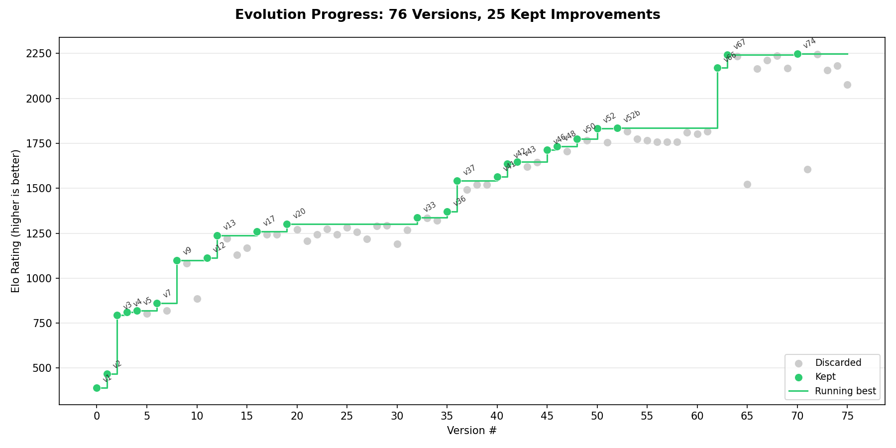
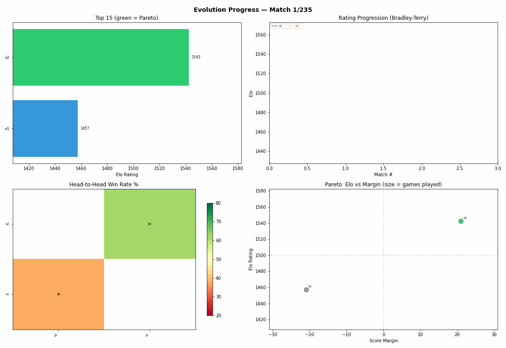

# autoevolve

Let a coding agent evolve your strategy overnight.

You have a bot, a prompt, or a strategy. You can pit two versions against each other and see which one wins. But manually tweaking, benchmarking, and tracking dozens of versions is tedious. What if an AI agent did that loop for you — creating variants, running matches, keeping the winners, and repeating while you sleep?

That's autoevolve. Three ideas that work well together:

1. **Agentic coding** — LLM agents are surprisingly good at iterating on hypotheses in environments with measurable feedback ([autoresearch](https://github.com/karpathy/autoresearch)). They can read code, propose changes, and run experiments autonomously.
2. **Self-play evaluation** — not every improvement can be measured by a unit test or a loss function. Some things — game strategies, negotiation tactics, adversarial robustness — can only be measured by playing against other versions.
3. **Genetic-Pareto search** — [GEPA](https://github.com/gepa-ai/gepa) showed that evolutionary search with LLM reflection can be 35x faster than RL (100-500 evaluations vs 5,000-25,000+) while achieving strong results (32% → 89% on ARC-AGI). Instead of collapsing everything to a scalar reward, keep a Pareto front of non-dominated solutions and branch from the best.

You define the arena and the rules. The agent runs the evolution — mutating strategies, benchmarking them head-to-head, and promoting the winners. This repo provides the loop and the tracking infrastructure.

Inspired by [GEPA](https://github.com/gepa-ai/gepa) and [autoresearch](https://github.com/karpathy/autoresearch).

## Example: 76 versions evolved through self-play





Real data from a strategy evolution experiment. 76 versions, 235 matchups, tracked and rated automatically. Green dots are kept improvements; gray dots are discarded. The staircase line tracks the running best.

## Getting started

```bash
git clone https://github.com/MrTsepa/autoevolve.git
cd autoevolve
```

Then open a coding agent (e.g. [Claude Code](https://docs.anthropic.com/en/docs/claude-code)) in this directory and say:

> Review program.md and help me set up an evolution experiment.

The agent will read `program.md`, ask you about your environment (what are you evolving? how do you evaluate?), help you fill in the blanks, and start running iterations.

That's it. The agent handles the loop — mutate, benchmark, record, check leaderboard, repeat. You watch the ratings climb.

### Manual setup

If you prefer to set things up yourself:

1. Edit `program.md` — define your environment, strategy format, and evaluation command
2. Create your first strategy version (v1)
3. The agent (or you) runs the loop:

```bash
python tracker.py record v2 v1 --wins 62 --losses 38      # log result
python tracker.py leaderboard                              # check standings
python tracker.py suggest v2                               # pick next opponent
python tracker.py progress                                 # visualize progress
```

## The loop

```
Generate   →  create a new version of the strategy
Evaluate   →  benchmark against previous versions
Promote    →  update ratings, crown the new best
Archive    →  log everything for traceability

repeat until convergence (or until you wake up)
```

Every match result is recorded in `matches.json`. Ratings are computed from scratch each time using [Bradley-Terry](https://en.wikipedia.org/wiki/Bradley%E2%80%93Terry_model) maximum likelihood — order-independent and globally optimal. The Pareto front identifies which versions are worth branching from next.

## What's here

```
program.md     agent instructions — start here
evolve.py      core loop + protocols (Artifact, Evaluator, Mutator)
ratings.py     Bradley-Terry Elo, per-version stats, Pareto front
tracker.py     CLI: leaderboard, record, plot, validate, suggest, animate
example/       real evolution data with animated visualization
```

The agent only touches the strategy files. Everything else is infrastructure.

## Tracker commands

| Command | What it does |
|---------|-------------|
| `record` | Log a match result |
| `leaderboard` | Show Elo rankings with Pareto front |
| `pareto` | Show non-dominated versions |
| `matrix` | Head-to-head win rate table |
| `plot` | Generate 4-panel overview (bars, progression, heatmap, Pareto) |
| `progress` | Generate progress.png (Elo over version #) |
| `validate` | Prediction accuracy + bootstrap CIs |
| `suggest` | Next opponent (information-theoretic) |
| `animate` | Generate progress.gif from match history |

All commands accept `--db path/to/matches.json`.

## How the ratings work

**Bradley-Terry MLE** finds the globally optimal ratings that best explain all match results simultaneously. Unlike sequential Elo, it doesn't depend on match order. 400 points = 10:1 win odds.

**Information-theoretic matchmaking**: `score = p*(1-p) / sqrt(games+1)` — prioritizes matchups that are both close (uncertain outcome) and undersampled.

**Pareto front**: versions compared across Elo, score margin, and win rate. Non-dominated versions are the best candidates to branch from.

## Prior art

- [GEPA](https://github.com/gepa-ai/gepa) — Genetic-Pareto evolutionary optimization of text parameters via LLM reflection
- [autoresearch](https://github.com/karpathy/autoresearch) — autonomous AI research via overnight LLM training experiments
- [Bradley-Terry model](https://en.wikipedia.org/wiki/Bradley%E2%80%93Terry_model) — pairwise comparison probability model
