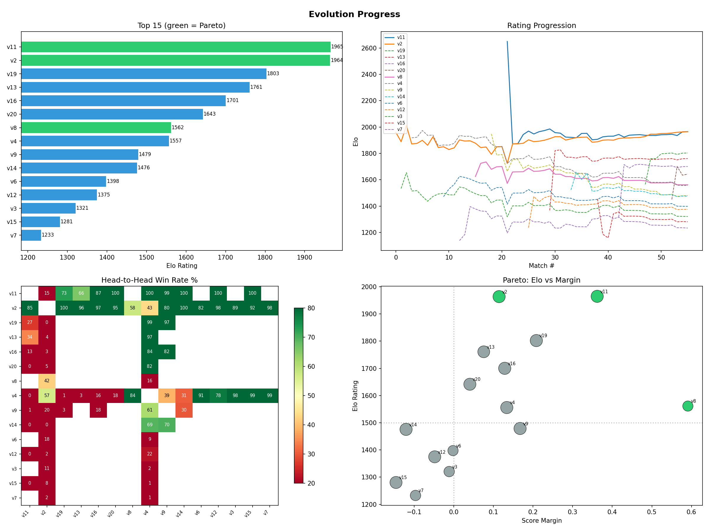

<div align="center">

# autoevolve

**[autoresearch](https://github.com/karpathy/autoresearch), but for self-play.** Instead of optimizing a scalar metric overnight, evolve strategies by competing against previous versions head-to-head.

[](https://docs.anthropic.com/en/docs/claude-code/skills)
[](LICENSE)
[](https://github.com/karpathy/autoresearch)
[](https://x.com/CepaStas18593)

</div>

- Mutate strategies with a coding agent
- Evaluate candidates head-to-head
- Keep the strongest versions and track progress over time
- Used in [Game AI Cup](https://gameaicup.com) to place [**6th out of 83 participants**](https://gameaicup.com/leaderboard?round=final%20round) — all code written by Claude Code

## Quick start with Claude Code

AutoEvolve works as a [Claude Code skill](https://docs.anthropic.com/en/docs/claude-code/skills). Install it and Claude Code learns how to run evolution experiments autonomously.

```bash
npx skills add MrTsepa/autoevolve -y
```

Or directly in Claude Code:

```bash
claude skill add https://github.com/MrTsepa/autoevolve@v0.1.0
```

Then ask Claude Code:

> Set up an autoevolve experiment to optimize my game bot.

> Help me evolve a better prompt for my summarization task.

> Run the next iteration of my evolution experiment.

See [`SKILL.md`](SKILL.md) for the full skill specification.

### Alternative: clone the repo directly

```bash
git clone https://github.com/MrTsepa/autoevolve.git
cd autoevolve
uv sync
```

Then open Claude Code in this directory and say:

> Review `program.md` and help me set up an evolution experiment.

## What is this?

`autoevolve` is a framework for iterative strategy improvement. You start with a prompt, bot, or strategy, let an AI agent create variants, benchmark them against previous versions, and keep the strongest candidates. The repo provides the loop, ratings, and tracking infrastructure — you define the arena.

## Good fits for autoevolve

- **Game bots** — evolve strategies through self-play in board games, card games, or real-time competitions
- **Prompt optimization** — two prompt versions produce outputs, an LLM judge picks the winner
- **Heuristic policies** — evolve readable decision trees, rule sets, or state machines instead of opaque neural network weights
- **Trading / search strategies** — backtest candidates on the same historical data, compare risk-adjusted returns
- **Adversarial attack/defense** — co-evolve red and blue team agents, both sides get stronger

In general, `autoevolve` is useful anywhere two versions can compete and you can decide which one won.

## Examples

### Prisoner's Dilemma



The [`examples/prisoners_dilemma/`](examples/prisoners_dilemma/) directory contains a complete worked example: evolving strategies for the Iterated Prisoner's Dilemma through automated self-play.

Starting from a trivial seed (Always Cooperate), 9 strategies were evolved using `--trace` for diagnosis, `suggest` for opponent selection, and `--record` for auto-recording. The champion combines [Gradual](https://www.jstor.org/stable/40602778) proportional punishment with opponent classification — detecting TFT via its mirroring behavior and switching to mirror mode to neutralize it. Result: **87% overall win rate**, nearly tying TFT (46%) while crushing everything else.

See the [full writeup](examples/prisoners_dilemma/README.md) for the evolution journey and key findings.

### Game AI Cup


The [`examples/game_ai_cup/`](examples/game_ai_cup/) directory contains data from a real evolution run used in the [Game AI Cup](https://gameaicup.com) competition: 76 versions and 235 head-to-head matchups tracked automatically. The approach placed [6th out of 83 participants](https://gameaicup.com/leaderboard?round=final%20round). Green points are accepted improvements, gray points are discarded candidates, and the staircase shows the running best score.

## How it works

```
Mutate → Evaluate → Rate → Branch → Repeat
```

- **Mutate** — create a new version with an AI coding agent
- **Evaluate** — run head-to-head comparisons
- **Rate** — update pairwise ratings and stats
- **Branch** — choose promising parents from the Pareto front
- **Repeat** — continue until progress slows or budget runs out

Every match result is recorded in `matches.json`. Ratings are computed from scratch each time using [Bradley-Terry](https://en.wikipedia.org/wiki/Bradley%E2%80%93Terry_model) maximum likelihood — order-independent and globally optimal. The Pareto front identifies which versions are worth branching from next.

## Minimal workflow

1. Define the strategy and evaluation rules in `program.md`
2. Create an initial candidate (`v1`)
3. Generate a mutation (`v2`)
4. Run a benchmark between `v2` and `v1`
5. Record results with `tracker.py`
6. Inspect the leaderboard and repeat

```bash
uv run tracker.py record v2 v1 --wins 62 --losses 38
uv run tracker.py leaderboard
uv run tracker.py suggest v2
uv run tracker.py progress

# All commands accept --db (before or after the subcommand, or via env var)
uv run tracker.py leaderboard --db path/to/matches.json
export AUTOEVOLVE_DB=path/to/matches.json
```

## Architecture

Under the hood, `autoevolve` separates mutation, evaluation, tracking, and rating so you can plug in your own domain-specific logic.

```
┌─────────────┐ pick parent  ┌─────────────┐  new version  ┌──────────┐
│   Selector  │─────────────►│   Mutator   │──────────────►│ Artifact │
│ (Pareto front              │ (LLM agent  │               │ (v1, v2, │
│  + suggest) │              │  edits code)│               │  ... vN) │
└──────▲──────┘              └─────────────┘               └────┬─────┘
       │                                                        │
       │ leaderboard                               head-to-head │
       │                                                        ▼
┌─────────────┐    record    ┌─────────────┐    results   ┌───────────┐
│   Tracker   │◄─────────────│   Ratings   │◄─────────────│ Evaluator │
│ matches.json│              │(Bradley-Terry│              │(benchmark)│
│   + CLI     │              │  Elo + stats)│              └───────────┘
└─────────────┘              └─────────────┘
```

## Why this exists

- **Agentic coding** — LLM agents are surprisingly good at iterating on hypotheses in environments with measurable feedback ([autoresearch](https://github.com/karpathy/autoresearch)). They can read code, propose changes, and run experiments autonomously.
- **Self-play / pairwise evaluation** — not every improvement can be measured by a unit test or a loss function. Some things — game strategies, negotiation tactics, adversarial robustness — can only be measured by playing against other versions.
- **Evolutionary search** — [GEPA](https://github.com/gepa-ai/gepa) showed that evolutionary search with LLM reflection can be surprisingly sample-efficient on certain benchmarks (100–500 evaluations vs 5,000–25,000+ for RL on ARC-AGI). Instead of collapsing everything to a scalar reward, keep a Pareto front of non-dominated solutions and branch from the best.

The motivation is similar to RL — iterative improvement via environment feedback — but with a coding agent instead of gradient descent. Where RL needs many episodes, differentiable rewards, and produces opaque weight updates, an LLM agent can read the code, analyze *why* a version lost, and propose a targeted fix. The upside is human-readable strategies and fast iteration; the downside is cost-per-step and the usual LLM reliability caveats. How far this scales is an open question — this repo is a tool for exploring it.

## Repository structure

| File | Purpose |
|------|---------|
| `program.md` | Agent instructions — define your environment, strategy format, and evaluation command |
| `evolve.py` | Core protocols and orchestration primitives (`Artifact`, `Evaluator`, `Mutator`) |
| `ratings.py` | Bradley-Terry ratings, per-version stats, Pareto front logic |
| `tracker.py` | CLI for recording, ranking, plotting, and suggestions |
| `examples/prisoners_dilemma/` | [Worked example](examples/prisoners_dilemma/README.md) — Iterated Prisoner's Dilemma with 9 evolved strategies |
| `examples/game_ai_cup/` | Sample evolution run with data and visualizations |

The domain-specific strategy files are yours; this repo provides the infrastructure around them.

## Tracker commands

| Command | Description |
|---------|-------------|
| `record` | Log a match result |
| `leaderboard` | Show Elo rankings with Pareto front and opponent coverage |
| `pareto` | Show non-dominated versions |
| `matrix` | Head-to-head win rate table |
| `plot` | Generate 4-panel overview (bars, progression, heatmap, Pareto) |
| `progress` | Generate Elo-over-version-number chart |
| `validate` | Prediction accuracy + bootstrap confidence intervals |
| `suggest` | Next opponent (information-theoretic) |
| `animate` | Generate progress.gif from match history |

All commands accept `--db path/to/matches.json`.

## How the ratings work

**Bradley-Terry MLE** finds the globally optimal ratings that best explain all match results simultaneously. Unlike sequential Elo, it doesn't depend on match order. 400 points = 10:1 win odds.

**Information-theoretic matchmaking**: `score = p*(1-p) / sqrt(games+1)` — prioritizes matchups that are both close (uncertain outcome) and undersampled.

**Pareto front**: versions compared across Elo, score margin, and win rate. Non-dominated versions are the best candidates to branch from.

## Demo scenario

Try the Prisoner's Dilemma example in under 10 minutes:

```bash
git clone https://github.com/MrTsepa/autoevolve.git
cd autoevolve/examples/prisoners_dilemma
uv sync
claude
# Ask: "Read program.md, check the leaderboard, and evolve the next strategy version."
```

Claude will check standings, analyze the current champion, propose a mutation, benchmark it, and record results autonomously.

## Publishing

To publish this skill:

1. Ensure the repo is public on GitHub
2. Verify `SKILL.md` is at the repo root
3. Test: `npx skills add MrTsepa/autoevolve -y`

## Roadmap

- More example tasks (see [`examples/prisoners_dilemma/`](examples/prisoners_dilemma/) for the first)
- Reusable mutator/evaluator templates
- Richer experiment summaries and plots
- Easier integrations with coding agents
- More domains: prompts, bots, trading, negotiation

## Related work

- [autoresearch](https://github.com/karpathy/autoresearch) — autonomous AI research via overnight LLM training experiments
- [awesome-autoresearch](https://github.com/WecoAI/awesome-autoresearch) — curated list of autoresearch use cases, implementations, and forks
- [GEPA](https://github.com/gepa-ai/gepa) — genetic-Pareto evolutionary optimization of text parameters via LLM reflection
- [Bradley-Terry model](https://en.wikipedia.org/wiki/Bradley%E2%80%93Terry_model) — pairwise comparison probability model

`autoevolve` differs by focusing on code-level mutations (not just text parameters) and head-to-head evaluation (not just scalar metrics), making it suited for competitive or adversarial domains.
